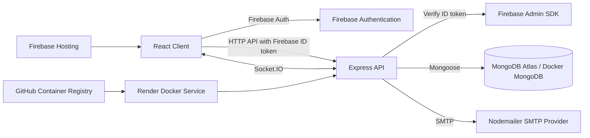
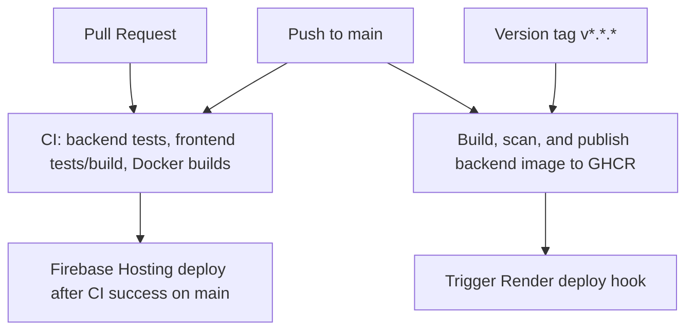

# Silent Auction Platform

[](https://github.com/fernandoh88/silent-auction-app/actions/workflows/ci.yml)
[](https://github.com/fernandoh88/silent-auction-app/actions/workflows/docker-publish.yml)
[](https://github.com/fernandoh88/silent-auction-app/actions/workflows/firebase-hosting.yml)

Real-time full-stack auction platform built with React, Express, MongoDB, Firebase Authentication, and Socket.IO. The project is configured for local Docker Compose usage, automated tests, GitHub Actions CI, GHCR image publishing, Firebase Hosting, and Render backend deployment.

## Production

- Live demo: https://silentauctionapp-4ca96.web.app
- Backend health: https://silentauction-3eqm.onrender.com/health
- Backend API base URL: https://silentauction-3eqm.onrender.com
- Backend container image: `ghcr.io/fernandoh88/silent-auction-server:latest`

## Features

- Firebase email/password authentication.
- Protected auction browsing and bidding.
- Admin-only auction creation, closing, and deletion.
- MongoDB-backed auction items and bid history.
- Real-time bid and auction-close events with Socket.IO.
- Winner and outbid email notifications through Nodemailer.
- Health endpoint at `/health` for Render, Docker, and uptime checks.

## Architecture



## Tech Stack

Frontend: React, Create React App, React Router, Axios, Socket.IO Client, Testing Library.

Backend: Node.js, Express, Mongoose, Firebase Admin SDK, Socket.IO, Nodemailer.

Database: MongoDB Atlas in production, MongoDB Docker container for local Compose.

Authentication: Firebase Authentication on the client, Firebase Admin token verification on the API.

Real-time communication: Socket.IO WebSocket and polling transports.

DevOps: Docker, Docker Compose, GitHub Actions, GitHub Container Registry, Render, Firebase Hosting.

Testing: Jest, Supertest, React Testing Library.

Deployment: Firebase Hosting for static frontend, Render Docker service for backend, MongoDB Atlas for production data.

## Local Development

Backend:

```bash
cd server
npm ci
cp .env.example .env
npm start
```

Frontend:

```bash
cd client
npm ci
cp .env.example .env
npm start
```

The client defaults to `http://localhost:5000` for API and Socket.IO traffic when `REACT_APP_API_URL` is not set. Production builds must set `REACT_APP_API_URL`.

## Docker

Run the local stack:

```bash
docker compose up --build
```

Services:

- `frontend`: nginx serving the React production build on `http://localhost:8080`.
- `backend`: Express and Socket.IO API on `http://localhost:5000`.
- `mongodb`: local MongoDB with persistent `mongodb_data` volume.

Docker Compose reads non-secret defaults from `docker-compose.yml` and supports environment variable overrides from your shell or a root `.env` file. Do not commit `.env` files. For authenticated flows in Docker, provide Firebase Admin credentials through environment variables.

## Environment Variables

Client variables are documented in `client/.env.example`:

- `REACT_APP_API_URL`
- `REACT_APP_ADMIN_EMAIL`
- `REACT_APP_FIREBASE_API_KEY`
- `REACT_APP_FIREBASE_AUTH_DOMAIN`
- `REACT_APP_FIREBASE_PROJECT_ID`
- `REACT_APP_FIREBASE_STORAGE_BUCKET`
- `REACT_APP_FIREBASE_MESSAGING_SENDER_ID`
- `REACT_APP_FIREBASE_APP_ID`

Server variables are documented in `server/.env.example`:

- `NODE_ENV`
- `PORT`
- `MONGO_URI`
- `CLIENT_URL`
- `CLIENT_URLS`
- `ADMIN_EMAIL`
- `SMTP_HOST`
- `SMTP_PORT`
- `SMTP_USER`
- `SMTP_PASS`
- `FROM_EMAIL`
- `FIREBASE_PROJECT_ID`
- `FIREBASE_CLIENT_EMAIL`
- `FIREBASE_PRIVATE_KEY`
- `FIREBASE_SERVICE_ACCOUNT_JSON`

For Firebase Admin in production, prefer either `FIREBASE_SERVICE_ACCOUNT_JSON` or the discrete `FIREBASE_PROJECT_ID`, `FIREBASE_CLIENT_EMAIL`, and `FIREBASE_PRIVATE_KEY` variables. Escaped `\n` sequences in `FIREBASE_PRIVATE_KEY` are normalized by the server.

## Testing

Backend:

```bash
cd server
npm test
```

Frontend:

```bash
cd client
npm test
npm run build
```

Backend tests mock Firebase Admin, email delivery, and database models. They do not send email or connect to production MongoDB.

## CI/CD



Pull requests run validation only. Pushes to `main` run CI, publish the backend Docker image to GitHub Container Registry, trigger Render when `RENDER_DEPLOY_HOOK_URL` is configured, and deploy the frontend to Firebase Hosting after CI succeeds.

## Deployment

Frontend: Firebase Hosting serves `client/build`. The production workflow uses `FIREBASE_SERVICE_ACCOUNT` and `FIREBASE_PROJECT_ID` GitHub Secrets.

Backend: Render should run the Docker image published to `ghcr.io/<github-owner>/silent-auction-server`. Configure Render environment variables from `server/.env.example`, set the service port to `5000` or use Render's `PORT`, and set the health check path to `/health`.

Database: Use MongoDB Atlas for production. Docker Compose uses the local `mongodb` service only for local development and production-like testing.

## Security

- `.env`, `.env.*`, service-account JSON files, build outputs, dependencies, and coverage output are ignored by Git.
- Docker images exclude local env files and Firebase service-account files through `.dockerignore`.
- The backend Docker image installs production dependencies only and runs as the non-root `node` user.
- Firebase Admin credentials are loaded from environment variables in production.
- Dependabot monitors npm dependencies and GitHub Actions.
- The backend image publishing workflow scans the production image with Trivy before pushing.
